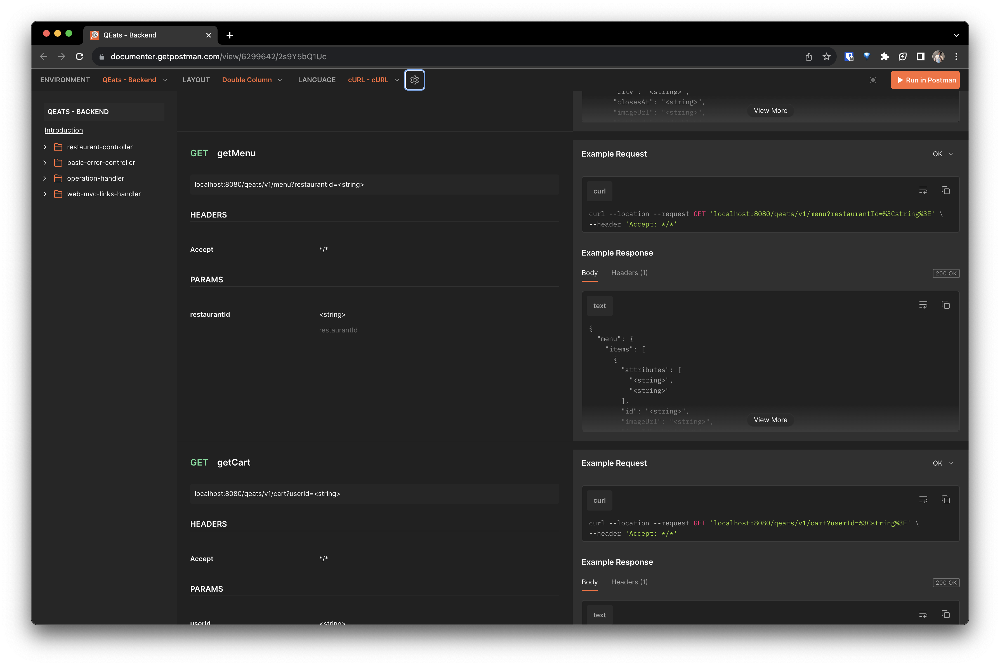
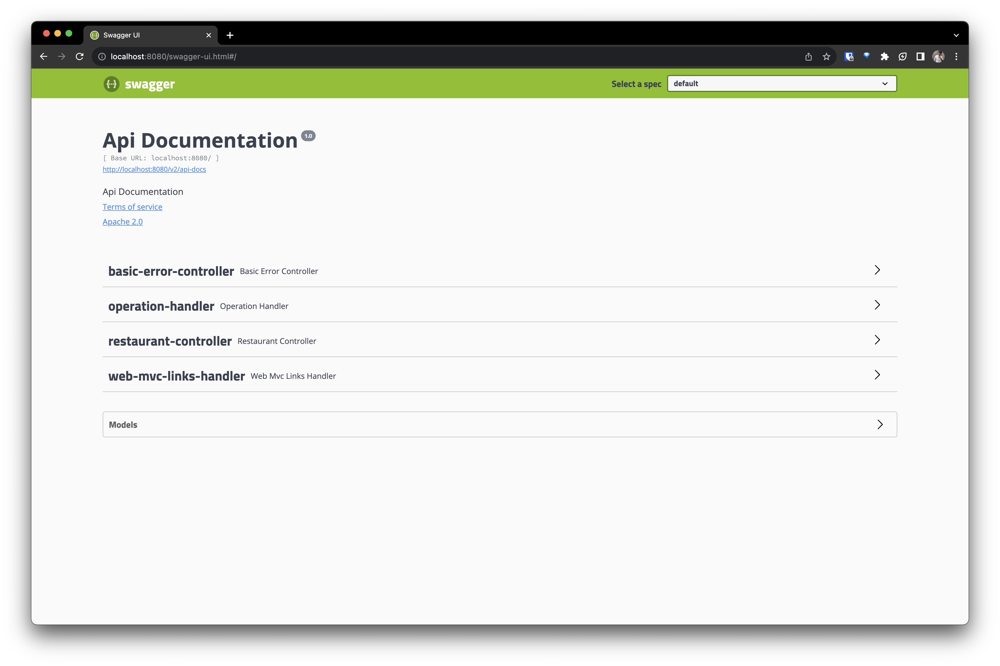

# QEats - Online Food Ordering Backend

Built a distributed system backend for food order platform, QEats, with **Java Spring Boot** and **MongoDB**. The system does caching using **Redis** and to further speed up database queries, they are run using **multi-threading**. We can easily deploy the solution to the Cloud using its **Docker** image.

### [✅ API Documentation](https://documenter.getpostman.com/view/6299642/2s9Y5bQ1Uc)

## APIs
- `GetRestaurants`
- `GetMenu`
- `GetCart`
- `AddItem`
- `DeleteItem`
- `PlaceOrder`

<h4 align="center"> Postman API Docs </h4>

## Installation

> Make sure you have [Docker](https://docs.docker.com/get-docker/) installed and running

1. Go to [qeats/Packages](https://github.com/AbhishekChd/qeats/pkgs/container/qeats)
2. Download latest version like: `docker pull ghcr.io/abhishekchd/qeats:latest`
3. Create a `.env` file to define `LATITUDE` and `LONGITUDE` to localize data
4. Run: `docker compose -f docker-compose.yml -p qeats up -d`
5. Open: [localhost:8080/swagger-ui.html](localhost:8080/swagger-ui.html#/)

<h4 align="center"> Swagger UI </h4>

